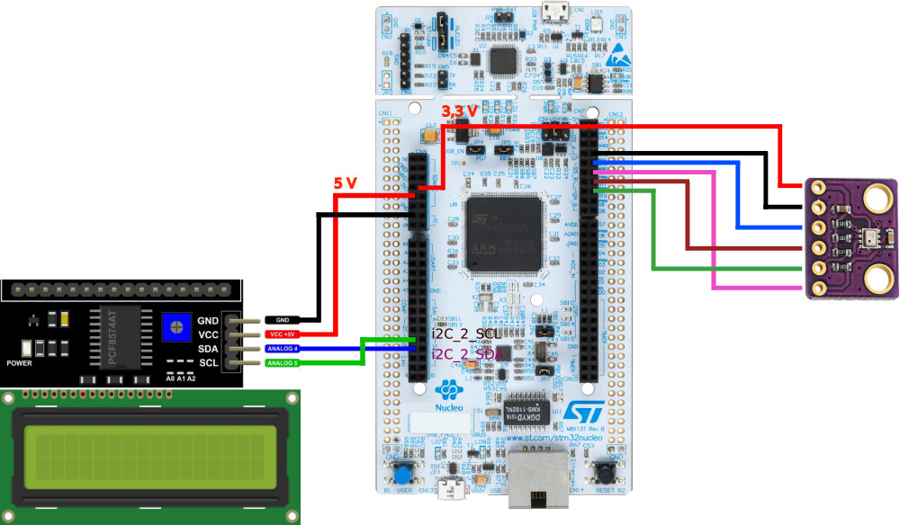
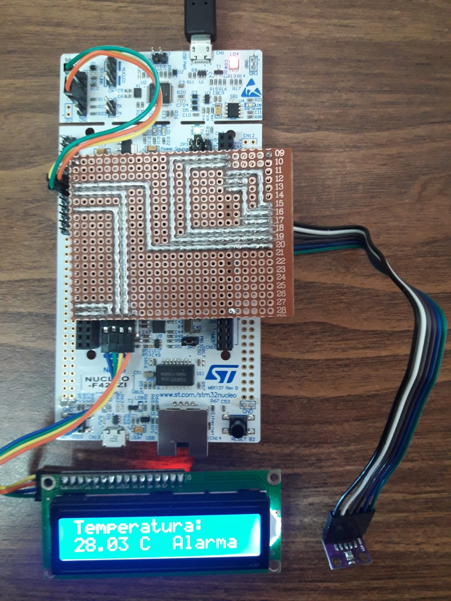

# Trabajo práctico °3
Testing de software para Sistemas Embebidos
Estudiante. Raúl Emilio Romero
Cohorte 21
Carrera de especialización en Sistemas Embebidos
# Aplicación

Termómetro con Alarma y visualización por pantalla LCD y UART

## Descripción

El termómetro se basa en el microprocesador STM32F429ZI desarrollado sobre la plataforma de desarrollo NUCLEO-144.
Cuenta un sensor de temperatura BMP280 y con una pantalla LCD 1602A

## Configuración de API

Ingrese al archivo termometroConfig.h y configure los parámetros principales del termómetro.

## Conexionado

## Foto del equipo en funcionamiento

# Versión

Versión 2. Nombre Termometro2

Autor: Raúl Emilio Romero
